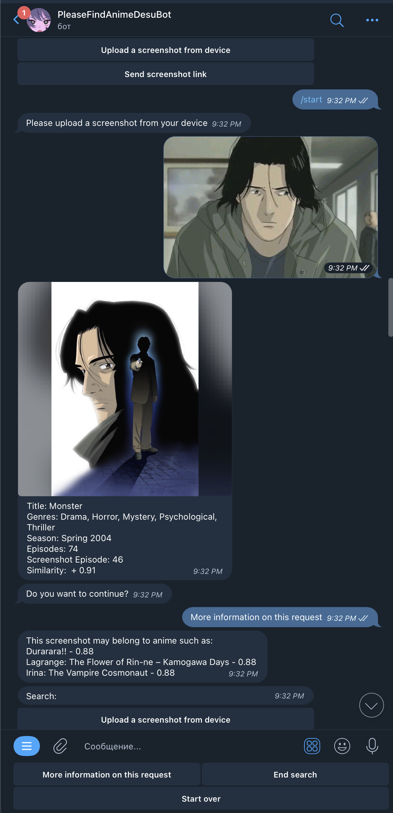

# PleaseFindAnimeDesuBot

PleaseFindAnimeDesuBot - это Telegram бот, который позволяет находить аниме по скриншотам из аниме-фильмов или сериалов. Просто отправьте боту изображение, и он предоставит информацию о соответствующем аниме, а также предложит несколько похожих вариантов.

### Ключевые особенности

- **Запуск бота**: Для начала использования бота, нажмите кнопку "start".
- **Выбор источника изображения**: Вы можете выбрать способ загрузки изображения - с устройства или по ссылке.
- **Анализ изображения**: После загрузки изображения бот отправит запрос на [trace.moe](https://trace.moe/), который выполнит анализ изображения и вернет ответ с информацией о соответствующем аниме.
- **Информация о найденном аниме**: Вы получите информацию о найденном аниме, включая название и дополнительные сведения.
- **Похожие аниме**: По вашему запросу бот предложит несколько похожих аниме, которые могут вам понравиться.

### Технологический стек

- **Python**: Программирование бота на языке Python.
- **Aiogram**: Используется для создания бота и взаимодействия с Telegram API.
- **Requests**: Для отправки HTTP-запросов на [trace.moe](https://trace.moe/).
- **BeautifulSoup**: Для парсинга данных с веб-страницы с информацией об аниме.
- **Urllib**: Для работы с изображениями по ссылке.

## Использование

1. Начните использование бота, нажав кнопку "start".
2. Загрузите изображение для анализа - с устройства или по ссылке.
3. Дождитесь ответа от бота, который предоставит информацию о найденном аниме.
4. Получите информацию о названии аниме, а также похожих вариантах, если вы захотите продолжить поиски.

## Как начать

Для начала использования бота, просто найдите [PleaseFindAnimeDesuBot](https://t.me/PleaseFindAnimeDesuBot) в Telegram и нажмите "start". Следуйте инструкциям бота для поиска аниме по вашим скриншотам! 

ВНИМАНИЕ! В данное время телеграм бот отключен :(

## Демонстрация работы

